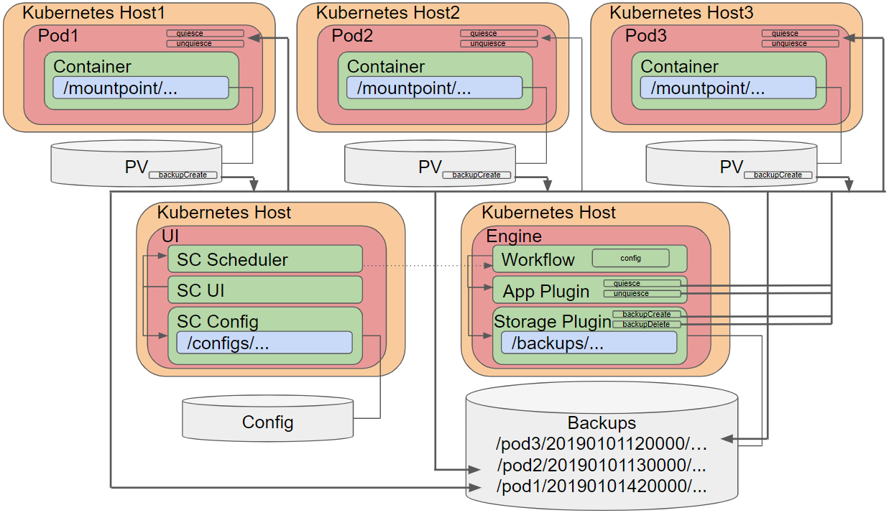

# General
Fossil is a container-native backup framework. It aims to provide an application consistent backup in the container-driven world using various plugins. Any application or storage system can be integrated. The plugin framework aims to support any programming language, even shell script.
We believe the backup process can be standardized and democratized using a dynamic plugin-driven workflow. Welcome to Fossil where you can save your applications state forever.

# Contribution
If you want to provide additional features, please feel free to contribute via pull requests or any other means.
We are happy to track and discuss ideas, topics and requests via 'Issues'.

# Architecture

# Plugins

## Application Plugins

### PostgreSQL
The postgres plugin requires WAL archive logging to be configured in order to perform backups. This is not enabled by default under OpenShift. First create an archive directory under `/var/lib/pgsql/data/userdata` by connecting to the pod via rsh. Next update the following parameters in the `/var/lib/pgsql/data/userdata/postgresql.conf`.

* wal_level=archive
* archive_mode=on
* max_wal_senders=3
* archive_command = '/bin/cp %p /var/lib/pgsql/data/userdata/archive/%f'
