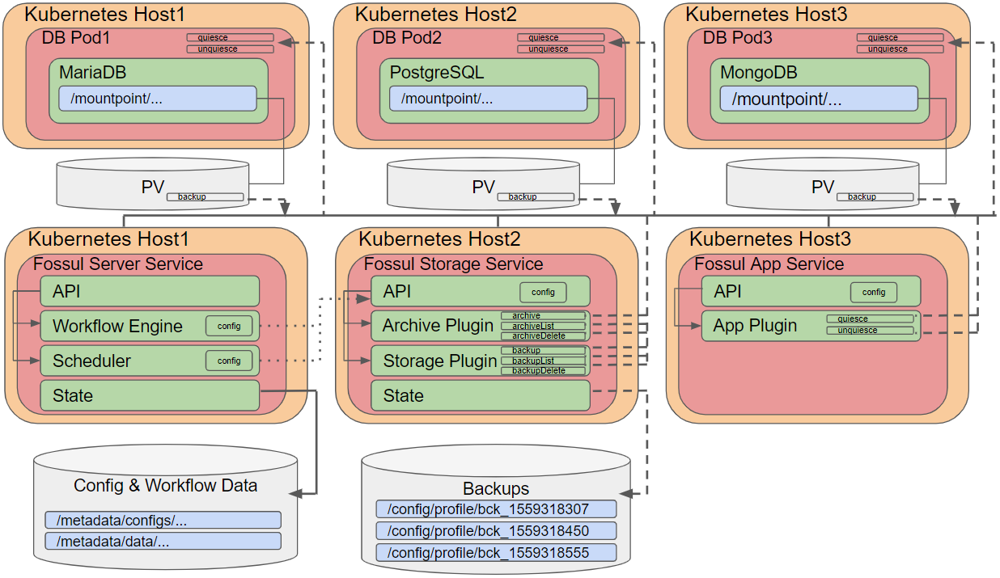
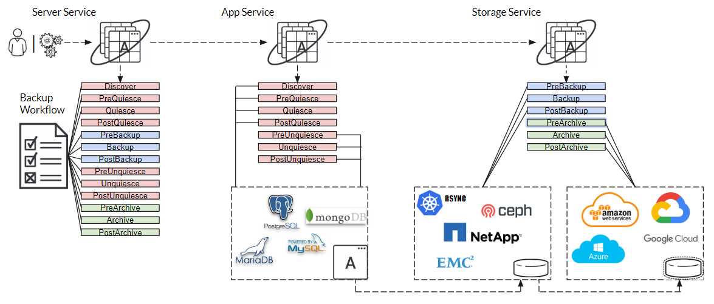
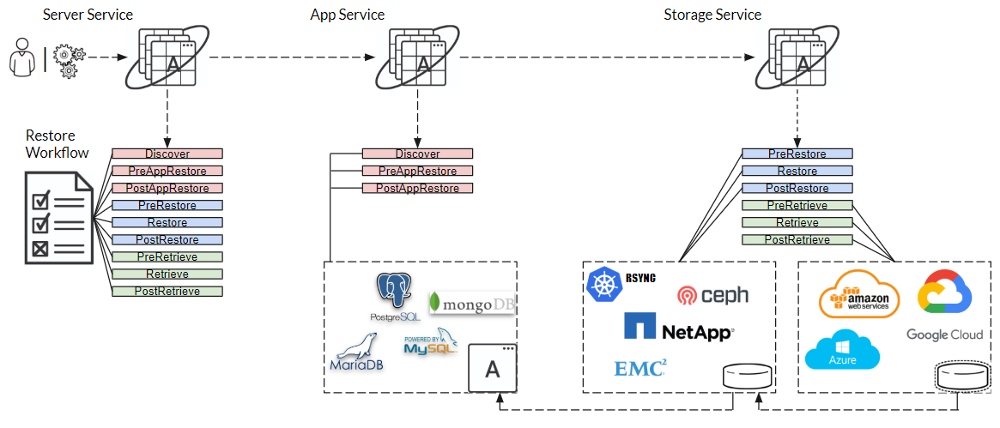

# General
Provides general information about the Fossul Framework and it's components.

## Fossul Architecture
The fossul architecture is a plugin based framework. Everything that happens in implemented in form of a method that executes inside a plugin. There are three main components that run as microservices inside containers. The server, application and storage services. The server is responsible for state, coordination and workflow. The application service is responsible for executing application plugins. The storage service is responsible for executing storage and archive plugins. Each service exposes it's own APIs. Nothing happens or can be done without issuing an API. In addition there is the CLI which is built on client libraries that marshall requests to the API. The framework, services, CLI and initial plugins are written in Go. Additional plugins can be written in any language, you choose!

Below is a high-level architecture diagram of the Fossul Framework and how the main components work together.



## Workflow Engine
Workflows and the ability to democratoize a process like backup or restore is the key to fossul. In fossul a workflow has it's own Id and a series of steps. Each workflow step is an API to a plugin or CMD that executes the step. In fossul you could just use commands and not even any plugins. The plugins or commands which are executed are decided upon within a configuration. A fossul workflow takes as input a configuration. Configurations also define any pre/post commands (simple commands or scripts that can be executed in workflow) and also the backup policy as well as retention. Each plugin also has it's own configuration. These are all loaded and added to the config which is passed into all plugin operations or calls. In case of basic plugin the config object is demarshalled into environment variables. Every workflow has it's own log of what happened during workflow execution. You can decide in configuration how long to keep workflows. Finally a workflow has a state RUNNING, COMPLETE or ERROR.

### Backup Workflow
The diagram below illustrates the data-flow in a backup workflow.


### Restore Workflow
The diagram below illustrates the data-workflow in a restore workflow.


## Profile
A profile is just an organizational unit or group of configurations.

## Configurations
A configuration lives under a profile. There are two types of configurations: main configuration and plugin configuration. A configuration is represented in TOML, a configuration file format. Configurations are pulled from the fossul server, edited in a file and then added back as a new configuration. This makes for maintaining and editing configurations very fast and easy.

## Job Scheduler
Fossul provides a job scheduler for scheduling of the various workflows. The scheduler implements a cron-style scheduler that utilizes cron syntax. Scheduler APIs are provided by the server service and scheduler job state is also stored on the server.

## Commands
Fossul framework allows user-defined commands to be executed via system calls. The main configuration has all the commands that can be executed. In fact you could just not use any plugins and do everything via commands if you wanted. The main idea though is to augment and provide maybe some special task capabilities that plugins aren't able to do through commands.

The commands itself is separated by its arguments via a ','. For example to print hello world as preQuiesceCmd you would do following.
```PreAppQuiesceCmd = "echo, hello world"```

## Plugins Framework
Fossul provides an extensive plugin framework. Plugins can be written in any language. There are two types of plugins native and basic. In fossul there are three types of plugins storage, application and archive. 

### Storage
Storage plugins expose the capabilities of the underlying storage. They are responsible for the physical data and backing up as well as restoring it. Storage plugins in fossul run under the storage micro-service.

### Application
Application plugins expose the capabilities of the application. Before a backup is taken the application must be quiesced or dumped. Once data is restored application recovery must be performed to bring the application back into operation using a specific dataset. These operations are performed by an application plugin. Application plugins run under the application micro-service

### Archive
Archive plugins expose capabilities of secondary or tiertiary storage. Data is sacred so just having a single copy, on likely expensive storage is not always good enough. Archiving backups to something like S3 allows for longer-term storage at a cheaper cost. It also protects against losing the initial backup for whatever reason. Archive plugins are very close to storage and as such these plugins also run under the storage micro-service.

### Server
In fossul the server micro-service is an orchestration layer. This is where the workflow lives and is executed. There are two workflows one for backup and the other restore. Fossul could however easily support additional workflows in the future. The server handles communication with the other services, provides standard messaging, error handling and state (configurations, jobs, workflows, etc).

### Native Plugins
Native plugins are written in go and loaded as a shared library. Native plugins also enforce plugin methods through an interface and are statically linked within the fossul plugin loader. Native plugins can however be written as well as compiled independently of the fossul framework. The fossul framework provides many client and plugin utility classes that are written in Go and native plugins get access to them. Native plugins also inherit their configuration as a object and can access and use API Objects without dealing with outputting JSON.

### Basic Plugins
Basic plugins are any plugins not written in Go or are not loaded using the fossul plugin loader. In other words that are not loaded as a shared library. Basic plugins can be written in any language, even shell script as they are executed via a system call. Their configuration is inherited via environment variables. For messages there is a standard output parser so a plugin simply needs to write to STDOUT in a specific format. Some methods, like pluginInfo (which exposes the methods, version and other information related to plugin) require JSON output.

There is really no advantage or disadvantage of native vs basic plugins. The framework provides plenty of examples of both. Native plugins require a static link in the plugin loader so the idea is that native plugins are added with new releases and basic plugins can be added anytime. Also as a plugin matures and becomes accepted in the framework it moves from a basic to native plugin. Basically it is up to you to decide.

## CLI
The fossul CLI consumes APIs provided by the various services using client libraries that implement and marshall the various rest calls. The CLI can be used remotely and requires a credentials file, usually stored in user home directory to access the various services. 

## API
API documentation is done using swagger for Go (swaggo). Each services provides API documentation for the APIs that are published by the service. Below are links to a Fossul test environment.
* [http://fossul-server-fossul.apps.46.4.207.247.xip.io/api/v1/index.html](http://fossul-server-fossul.apps.46.4.207.247.xip.io/api/v1/index.html)
* [http://fossul-app-fossul.apps.46.4.207.247.xip.io/api/v1/index.html](http://fossul-app-fossul.apps.46.4.207.247.xip.io/api/v1/index.html)
* [http://fossul-storage-fossul.apps.46.4.207.247.xip.io/api/v1/index.html](http://fossul-storage-fossul.apps.46.4.207.247.xip.io/api/v1/index.html)
